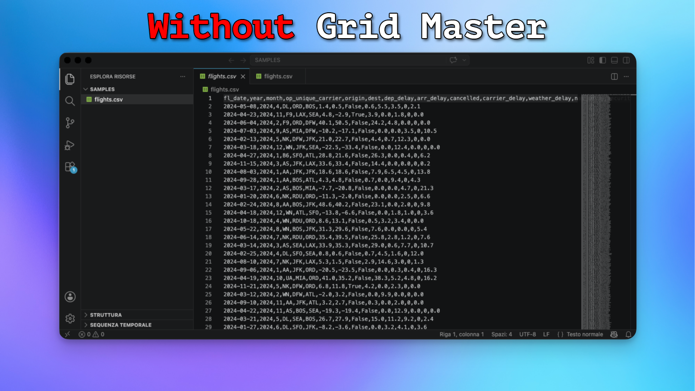
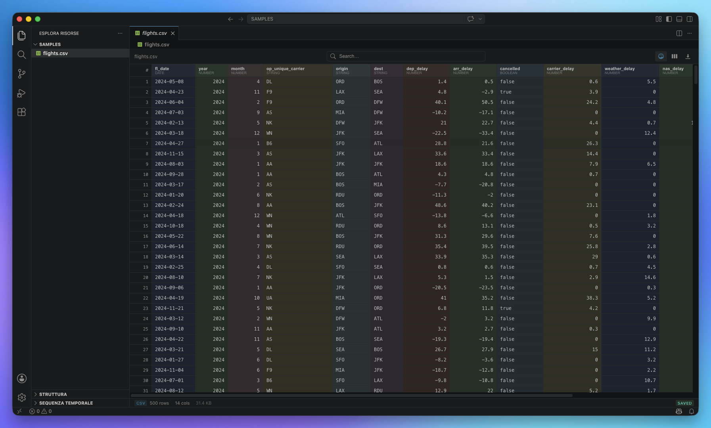
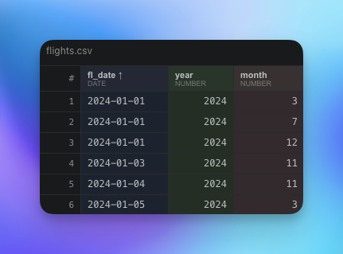
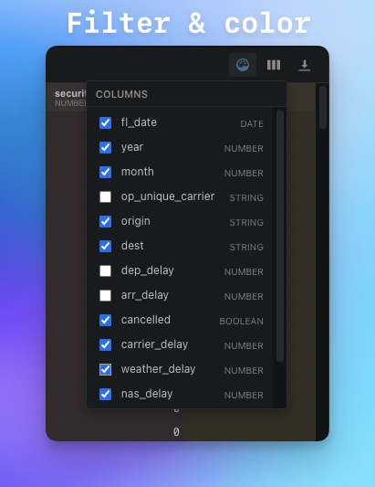

# Grid Master

**The fast data grid for VS Code.** Open CSV, Parquet, Arrow, Excel, JSON, SQLite, Avro and ORC files as an interactive spreadsheet — sort, filter, search, edit and color-code columns without ever leaving the editor.

<table align="center" width="100%"><tr>
  <td align="center" width="48%"><strong>Without Grid Master</strong></td>
  <td width="4%"></td>
  <td align="center" width="48%"><strong>With Grid Master</strong></td>
</tr><tr>
  <td align="center"></td>
  <td></td>
  <td align="center"></td>
</tr></table>

---

## Supported formats

| Format | Extensions | Notes |
|---|---|---|
| CSV / TSV | `.csv` `.tsv` | Auto-detects delimiter; instant open |
| Apache Parquet | `.parquet` `.parq` | WASM-based; partitioned directories supported |
| Apache Arrow / Feather | `.arrow` `.feather` | Direct Arrow IPC decoding |
| JSON | `.json` | Right-click → Open with Grid Master |
| Newline-delimited JSON | `.jsonl` `.ndjson` | Opens as default editor |
| Excel workbooks | `.xlsx` `.xlsb` `.xls` `.xlsm` | First sheet loaded via SheetJS |
| Apache Avro | `.avro` | Decoded on extension host via avsc |
| SQLite | `.db` `.sqlite` `.sqlite3` | Multi-table support with quick-pick |
| Apache ORC | `.orc` | Requires Python 3 + `pip3 install pyorc` |

**Partitioned Parquet/Arrow datasets** (Spark-style `*.parquet` directories containing `part-*.snappy.parquet` files) are detected automatically and loaded as a single merged table.

---

## Features

### Fast rendering
- **Virtualised grid** — only the rows in the visible viewport are rendered. Scroll through million-row Parquet files at 60 fps.
- **Lazy loading for large files** — tables over 100k rows are served in chunks; the grid is interactive immediately while data streams in the background.
- **LRU chunk cache** — memory stays bounded no matter the file size.

### Sort, filter, search
- **Click-to-sort** on any column header — cycles ascending → descending → off.
- **Per-column filters** — equals, contains, greater than, regex, is null, and more.
- **Global search** — instantly filters all rows across every column.
- **Live row count** — see how many rows match the current query.

### Editing
- **Inline editing** — double-click any cell to edit in place.
- **Per-edit Undo** — step back one change at a time.
- **Discard all** — revert every pending edit in one click.
- **Save** — write changes back to the file (CSV/TSV).

### Column tools
- **Drag-to-resize** column borders. Double-click the resize handle to auto-fit.
- **Hide/show columns** from the toolbar dropdown.
- **Column color coding** — pastel palette makes wide tables easier to scan.
- **Column statistics** — min, max, distinct count and null count on demand.

### Persistence & privacy
- **Sidecar** — column widths and hidden columns are saved to a tiny `.gridmaster.json` file next to your data. Reopen and pick up where you left off.
- **100% offline** — files are never uploaded. No telemetry, no network requests. Parquet and Arrow WASM are bundled inside the extension.

---

## See it in action

  

<!--
  DEMO VIDEO / GIF: place one file in the assets/ folder:
    assets/demo.gif   (recommended, ≤ 8 MB, ~10–20 seconds)
  Or for video on GitHub: replace the  above with:
    <video src="assets/demo.mp4" autoplay loop muted width="80%"></video>
  Note: VS Marketplace and Open VSX do not play <video> — use GIF for broadest compatibility.
-->

---

## Details

<table align="center" width="100%"><tr>
  <td align="center" width="48%"><strong>Sort</strong></td>
  <td width="4%"></td>
  <td align="center" width="48%"><strong>Filter &amp; color</strong></td>
</tr><tr>
  <td align="center"></td>
  <td></td>
  <td align="center"></td>
</tr></table>

<!--
  DETAIL SCREENSHOTS: place two PNG files in the assets/ folder:
    assets/screenshot-sort.png     (e.g. a column sorted ascending/descending)
    assets/screenshot-filter.png  (e.g. filter panel open + column colors active)
  Recommended: 1280×800 px, PNG, ≤ 300 KB each.
-->

---

## Getting started

1. **Install** Grid Master from the VS Marketplace or Open VSX.
2. **Open any supported file** — Grid Master activates automatically for `.csv`, `.tsv`, `.parquet`, `.arrow`, `.feather`, `.jsonl`, `.ndjson`, `.xlsx`, `.xlsb`, `.xls`, `.xlsm`, `.avro`, `.db`, `.sqlite`, `.sqlite3`, `.orc`.
3. **JSON files** (`.json`) are not set as default to avoid overriding the built-in editor. Right-click in the Explorer and choose **Open with Grid Master**.
4. **ORC files** require Python 3 with pyorc: `pip3 install pyorc`.
5. **Partitioned datasets** — right-click the folder in the Explorer and choose **Open with Grid Master**, or just open any part-file and accept the popup.

---

## Commands

| Command | Description |
|---|---|
| `Open with Grid Master` | Open the selected file or folder in the grid (Explorer context menu) |
| `Grid Master: Open as Text` | Re-open the current file in VS Code's plain-text editor |
| `Grid Master: Set as Default Editor` | Register Grid Master as the default editor for all supported formats |
| `Grid Master: Export as CSV` | Save the current filtered/sorted view to a CSV file |
| `Grid Master: Show Column Statistics` | Min, max, distinct count and null count for the focused column |
| `Grid Master: Open Partitioned Dataset Folder…` | Pick a Parquet/Arrow folder from a dialog |

---

## Configuration

| Setting | Default | Description |
|---|---|---|
| `gridMaster.csvDelimiterAutoDetect` | `true` | Auto-detect CSV/TSV delimiter |
| `gridMaster.csvDelimiter` | `,` | Fallback delimiter when auto-detect is off |
| `gridMaster.maxRowsInMemory` | `25000` | Maximum rows kept in the LRU cache |
| `gridMaster.chunkSize` | `500` | Rows per virtual-scroll chunk |
| `gridMaster.dateFormat` | `auto` | Date display format: `auto`, `ISO`, or `locale` |

---

## Performance

| Format | Where parsed | Notes |
|---|---|---|
| CSV / TSV | Main thread | PapaParse; up to ~500 MB in under a second |
| Parquet / Arrow | Web Worker (WASM) | parquet-wasm + Apache Arrow JS; chunk-based lazy reads |
| JSON / NDJSON | Web Worker | Inline parser; no `eval`, fully CSP-compliant |
| Excel | Web Worker | SheetJS; first sheet only |
| SQLite | Extension host | sql.js WASM; multi-table quick-pick |
| Avro | Extension host | avsc decoder |
| ORC | Extension host | python3 -m pyorc subprocess |

---

## Requirements

- VS Code **1.74** or later.
- ORC files: Python 3 with `pip3 install pyorc`.
- All other formats: no additional dependencies (WASM runtimes are bundled).

---

## Issues & feedback

Found a bug or want a new feature? [Open an issue on GitHub](https://github.com/sciro24/vscode_grid_master/issues).

---

## License

MIT
